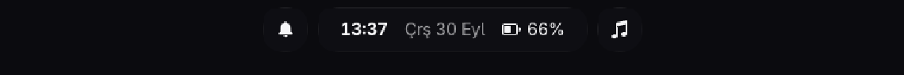
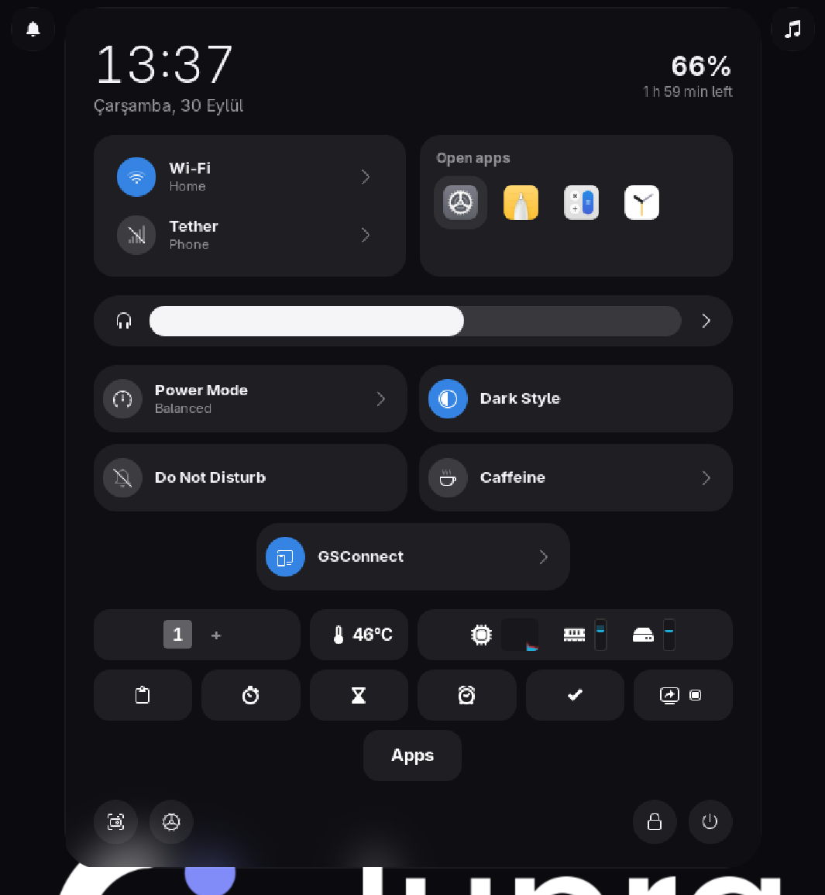
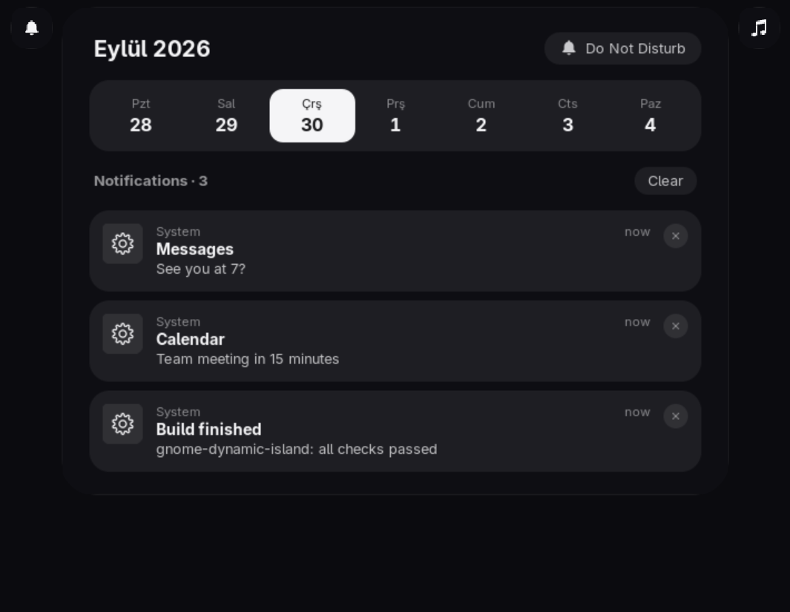
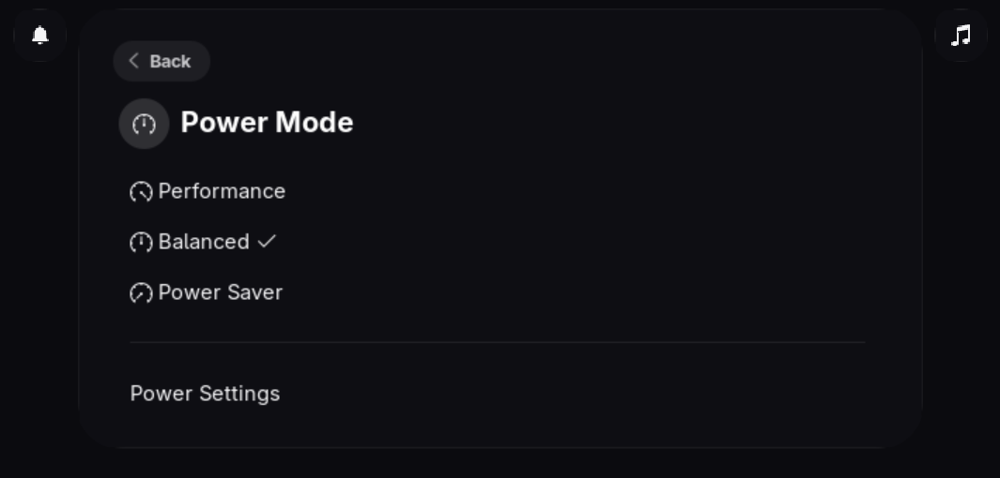
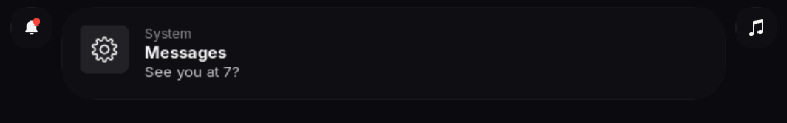
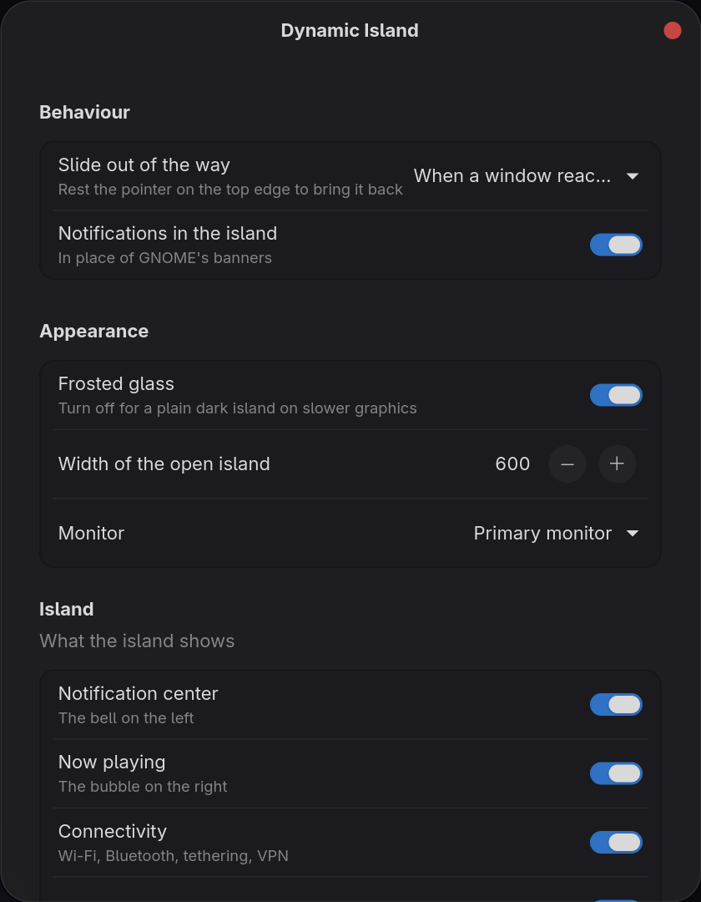

# Dynamic Island for GNOME

A GNOME Shell extension that turns the top bar into a small frosted-glass island in
the middle of the screen, with a control center, notifications and what is playing.

<p align="center"></p>

<p align="center">
  
  
</p>

## What it does

- **Collapsed:** a small pill with the time, date and battery. Windows use the whole
  screen.
- **Click it** and it springs open into a control center, its modules drifting in one
  after another:
  - a large clock and the battery time left
  - a connectivity card (Wi-Fi, Bluetooth, tethering, VPN, airplane mode) and the apps
    that are open right now
  - thick sliders for volume, microphone and brightness
  - every other Quick Settings toggle as a tile: power mode, dark style, night light,
    Do Not Disturb, and the ones other extensions add (Caffeine, GSConnect...)
  - your other extensions' panel icons
  - screenshot, settings, lock and power along the bottom

  A toggle's arrow slides over to a page of its own (the Wi-Fi networks, the power
  options) with a way back. `Super+S` opens it too.

  

- **Notifications** appear in the island instead of GNOME's banners, with the same
  rules (Do Not Disturb, per-app settings, urgency).

  

- **The bell** on the left opens a notification center with this week and your
  notifications as cards. A red dot means something arrived you have not seen.
  `Super+V` opens it too.
- **The bubble** on the right shows what is playing (Spotify, a browser video, any MPRIS
  player). Click it for cover art, progress and controls.
- **Out of the way:** in fullscreen, or when a window reaches up under it, the island
  slides up. Rest the pointer on the top edge to bring it back. Desktop icons (Desktop
  Icons NG) keep clear of it.

The text follows your system language.

## Install

From source:

```bash
git clone https://github.com/HIMURAw/gnome-dynamic-island.git
cd gnome-dynamic-island
./install.sh
```

Or download `dynamic-island@himuraw.shell-extension.zip` from the
[latest release](https://github.com/HIMURAw/gnome-dynamic-island/releases/latest) and run:

```bash
gnome-extensions install --force dynamic-island@himuraw.shell-extension.zip
gnome-extensions enable dynamic-island@himuraw
```

Then log out and back in: on Wayland GNOME only loads new extensions at login.

To turn it off and get the normal top bar back:

```bash
gnome-extensions disable dynamic-island@himuraw
```

## Settings

Open **Extensions → Dynamic Island → Settings**, or run
`gnome-extensions prefs dynamic-island@himuraw`.



- **Slide out of the way:** never, only in fullscreen, or also when a window reaches
  under the island
- **Notifications in the island**, or GNOME's own banners
- **Frosted glass:** turn it off for a plain dark island on slower graphics
- **Width** of the open island, and which **monitor** it sits on
- Which parts to show: the bell, the now playing bubble, and each control center module

Changes apply straight away.

## Requirements and compatibility

- GNOME Shell 50. Earlier versions are not tested yet; reports and pull requests are
  welcome.
- Works with the default theme and custom shell themes (tested with MacTahoe).
- Extensions that also change the top bar get in each other's way. The settings window
  lists the ones it finds:
  - **Dash to Panel**, **Hide Top Bar**, **Open Bar**: use one or the other.
  - **Just Perfection**: leave its panel options at their defaults.
  - **Blur my Shell**: turn off its *panel* blur, or a strip can stay at the top of the
    screen. Its other blurs are fine.
- Other extensions' panel icons and Quick Settings toggles move into the island on
  their own, including ones enabled later.

## Troubleshooting

- **Nothing changed after installing:** log out and back in.
- **The top bar is gone and the island is not there:** check the log (below). The
  extension keeps GNOME's own top bar when it cannot start, so this usually means it is
  disabled; `gnome-extensions enable dynamic-island@himuraw` and log in again.
- **Log:** `journalctl -b -o cat /usr/bin/gnome-shell | grep -i -A5 "dynamic island"`

When one part fails (after a GNOME update, say), the rest keeps working and the log says
which part.

## How it works

- The top bar (`Main.panel`) is hidden, not removed, and reserves no space.
- GNOME's own Quick Settings items move into the island's modules
  (`quicksettings.js`), so they keep working exactly like GNOME's. Panel icons move into
  the island's tray. Disabling the extension puts each one back where it was.
- The glass is a blurred clone of the windows behind the island, clipped to a rounded
  shape by a small shader (`glass.js`). Motion uses a damped spring (`spring.js`).
- While hidden the island is not drawn, and menu glass only exists while a menu is open.

## Development

Test in a nested session so you do not have to log out:

```bash
sudo dnf install mutter-devkit   # Fedora
./build.sh locale                # compiles translations and settings schemas
dbus-run-session gnome-shell --devkit --wayland
```

After closing a nested session that was killed rather than quit, delete
`/run/user/$UID/gnome-shell-disable-extensions` if it is there. GNOME takes it as a sign
of a crash and starts your next session with extensions off.

- `npm install && npx eslint .` lints the code; CI runs the same on every push.
- `./build.sh pack` builds the zip for extensions.gnome.org.
- `./build.sh pot` refreshes the translation template after changing strings.
- Pushing a tag like `v1.1` publishes a GitHub release with the zip.

Logs: `journalctl -f -o cat /usr/bin/gnome-shell`

## Translating

Copy `po/dynamic-island@himuraw.pot` to `po/<language>.po` (for example `po/de.po`),
fill in the `msgstr` lines and open a pull request. `msgfmt --check po/<language>.po`
catches mistakes before you send it.

Available: English, Turkish.

## Contributing

Bug reports and ideas are welcome in
[issues](https://github.com/HIMURAw/gnome-dynamic-island/issues); the bug form asks
for the few details needed to reproduce a problem (GNOME version, theme, other
extensions, log).

## License

GPL-3.0-or-later
